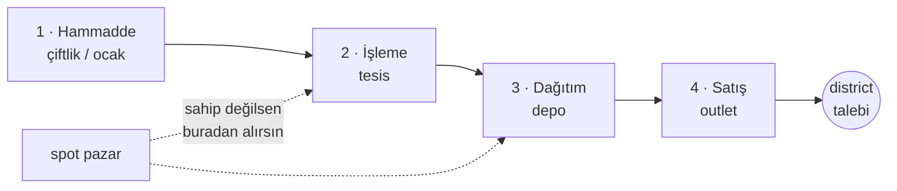
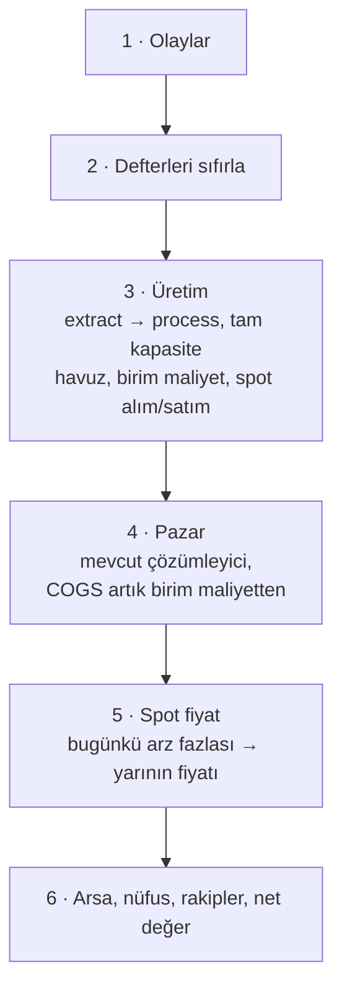

# Tur 1 — Ürün ve Zincir · Tasarım Belgesi

> Durum: **A, B ve C parçaları kodlandı** — motor katmanı (ürünler, spot
> pazar, birim maliyet, imar, şema v3), zincir kartı arayüzü ve rakiplerin
> zincir kararları. §10'daki iş sırasına bakın. Amaç, `Capitalism.md`'deki
> "sofistike simülasyon, casual oynanış" sözünü tutarak oyuna türün
> kimliğini veren katmanı eklemek: satılan şeyin bir maliyeti, o maliyetin
> bir zinciri, o zincirin de bir sahibi olsun.

---

## 1. Problem

Bugün bir outlet'in satış maliyeti tek satır:

```ts
const cogs = units * category.basePrice * category.costRatio * costModifier;
```

`costModifier` yalnızca "yakınında depon/fabrikan var mı" sorusuna bakan iki
sabit çarpandır (`WAREHOUSE_COST_BONUS = 0.88`, `FACTORY_COST_BONUS = 0.85`).
Yani maliyet oyuncunun kararlarından neredeyse bağımsız bir sabit.

Sonuç: oyuncunun elinde iki kaldıraç var — **konum** ve **kapasite**. Fiyat
savaşının tabanı yok, tedarik riski yok, dikey entegrasyon yok, tekel yok.
Oyun bir *emlak tycoon'u*; Capitalism ise bir *firma işletme* oyunu.

Bu belge o tek satırı bir zincire çeviriyor.

---

## 2. Model

### 2.1 Ürün (Good)

Üç kademe. Tüketici ürünleri bir kategoriye bağlı; hammadde ve ara mallar
değil.

```ts
export type GoodTier = 'raw' | 'intermediate' | 'consumer';

export interface GoodDef {
  id: string;
  name: string;
  tier: GoodTier;
  /** Yalnızca consumer için: hangi tüketici kategorisinde yarışır. */
  category: CategoryId | null;
  /** Bu ürünü üretmek için gereken bir alt kademe ürün (raw ise null). */
  inputGoodId: string | null;
  /** Spot pazar referans fiyatı. Tüketici ürünlerinde 0 — işlem görmez. */
  basePrice: number;
  /**
   * Yalnızca consumer: zincirden bağımsız perakende işleme maliyeti.
   * Ambalaj, fire, raf işçiliği — zincire sahip olmak bunu ucuzlatmaz,
   * yalnızca depo menzili kısmen hafifletir.
   */
  retailCost: number;
  /** Kategori talebinin bu ürüne düşen payı (aynı kategoride toplam 1). */
  demandShare: number;
  color: string;
}
```

Tüketici ürünü spot pazarda işlem görmez: tüketiciye satılır, şirketler
arasında değil. Zincirin son halkası **outlet'in kendisidir** — ara malı
alır, `retailCost` kadar işler ve satar. Dolayısıyla denge kısıtı şu kimliğe
indirgenir ve `goods.ts` bunu birebir sağlar:

```
basePrice(ara mal) + retailCost(tüketici ürünü)  ===  basePrice × costRatio
```

**Zincir derinliği sabit: 3.** Hammadde → ara mal → tüketici ürünü. Değişken
derinlik esneklik verirdi ama zincir kartını okunmaz yapardı; sabit derinlik
tek bir UI şablonuyla her ürünü anlatmayı mümkün kılıyor.

### 2.2 Ünite rolleri

`BuildingRole` genişliyor:

| Rol | Bugün | Yarın |
|---|---|---|
| `outlet` | tüketiciye satar | tüketiciye satar, **raflarında ürün taşır** |
| `rental` | kira üretir | değişmez |
| `logistics` | %12 sabit indirim | **dağıtım maliyetini düşürür, zincirin 3. yuvası** |
| `production` | %15 sabit indirim | **kaldırılır**, yerine ↓ |
| `extract` | — | hammadde üretir (girdisi yok) |
| `process` | — | hammadde → ara mal dönüştürür |

### 2.3 Zincir kartının dört yuvası



Dağıtım bir üretim kademesi değil; maliyet kalemi. Ama oyuncunun zihninde
zincirin bir halkası olduğu için karta dördüncü yuva olarak giriyor. Depo
kurmak, ürün maliyetini değil **dağıtım payını** düşürür.

---

## 3. Spot pazar

Zincirin casual olmasını sağlayan şey bu: **sahip olmadığın her halkayı
pazardan alabilirsin.** Zinciri hiç kurmadan da baştan sona oynanır, sadece
marjın ince olur. Dikey entegrasyon bir zorunluluk değil, bir optimizasyon.

Her ürün için şehir geneli tek bir spot fiyat:

```
fazla   = max(0, üretim[g] - tüketim[g])          // şirketlerin yarattığı arz fazlası
doluluk = min(1, fazla / referansHacim[g])
hedef   = basePrice[g] * olayÇarpanı * (1 - 0.40 * doluluk)
spot[g] += (hedef - spot[g]) * 0.15
spot[g]  = clamp(basePrice * 0.60, basePrice * 1.80, spot[g])
```

> **Uygulama sırasında değişen tek şey bu formül.** Taslakta fiyat, arz/talep
> oranıyla iki yönde de hareket ediyordu (`balance ^ -0.6`). Ama o kural
> §6.1'deki denge kısıtını çiğniyor: mağaza açan ama üretmeyen bir oyuncu
> talep yarattığı anda fiyat yükselirdi, yani zincirsiz oyun zincir öncesine
> göre pahalılaşırdı. Bunun yerine: **fiyat yalnızca arz fazlasıyla düşer;
> yukarı baskı olaylardan gelir.** Kısıt korunuyor ve kıtlık dramı haber
> akışında okunabilen bir yere — olaylara — taşınıyor.

Dört sonuç:

- **Bolluk fiyatı düşürür.** Üç rakip aynı anda çip fabrikası kurarsa hepsi
  zarar eder. Aşırı yatırımın bir cezası olur — bugün yok.
- **Olaylar gerçekten acıtır.** "Kahve rekoltesi kötü" artık soyut bir talep
  çarpanı değil, çiftliği olmayanın maliyetine binen somut bir yük. Ölçülen
  asimetri: kriz anında pazardan alanın birim maliyeti 12,60 → 15,59 ₺
  çıkarken kendi bahçesi olanınki 8,80 ₺'de sabit kalıyor.
- **Fazla üretim bir iştir.** Tükettiğinden fazla üretiyorsan farkı spot'a
  satarsın. Hiç mağazası olmayan, sadece un satan bir oyuncu geçerli bir
  stratejidir — sıfır ek arayüzle. Hacim döken taraf sen olduğun için fazla
  üretim %15 iskontoyla satılır.
- **Referans hacim haritadan türer.** Şehir büyürse referans da büyür; yani
  bir fabrikanın fiyat üzerindeki etkisi harita boyutuna göre kendiliğinden
  dengelenir, elle ayarlanmış bir sabit değildir.

---

## 4. Maliyet muhasebesi

Her ünite bir birim maliyet üretir:

```
extract:  unitCost = (upkeep + wages) / output
process:  unitCost = inputUnitCost + (upkeep + wages) / output
outlet:   cogs     = units × (girdiMaliyeti + dağıtım + perakendeİşleme)
```

Girdi maliyeti **harmanlanır**: kendi üretiminden karşıladığın oran kadar
kendi maliyetin, kalanı spot fiyat.

```
internalShare = min(1, kendiÜretim[g] / kendiTüketim[g])
unitCost[g]   = internalShare × kendiMaliyet[g] + (1 - internalShare) × spot[g]
```

### 4.1 Kritik basitleştirme: şehir geneli havuz

Zincir **kendi kendini bağlar**. Hangi çiftliğin hangi fabrikayı beslediği
diye bir soru yok: şirketin şehirdeki tüm üretimi tek havuza girer, tüm
tüketimi aynı havuzdan çeker. Rota çizme yok, ünite kablolama yok,
sürükle-bırak yok.

> Bu, belgedeki en önemli tek karar. Capitalism II casual oyuncuyu tam olarak
> burada — binanın içinde üniteleri elle bağlatarak — kaybediyor. Mesafeyi
> rota ile değil, **dağıtım maliyeti** ile modelliyoruz: deposu olmayan
> şirket şehir geneli havuzu kullanır ama birim başına ek dağıtım öder.

```
depoKapsamında = outlet, kendi deposunun menzilinde mi (0 veya 1)
perakendeMaliyeti = good.retailCost × (1 - 0.25 × depoKapsamında)
```

Mevcut `warehouse.radius = 8` mekaniği aynen korunur; sabit %12 COGS
indirimi yerine gerçek bir kaleme — perakende işleme maliyetine — bağlanır.
Kapsam outlet başına ikili (menzilde ya da değil), şirket geneli bir oran
değil: hem daha okunaklı hem de günlük maliyeti düşük.

---

## 5. Günlük tick sırası

Üretim bugünkü satışa bağlı, satış da bugünkü maliyete bağlı. Döngüyü
kırmak için **rafların çekişi dünkü satıştan** okunur. Bu gecikme bir kusur
değil, tasarımın parçası: fazla/eksik üretim salınımı "darboğaz" durumunu
anlamlı kılar.



**Her üretim ünitesi tam kapasite çalışır.** Böylece bir çiftlik asla atıl
kalmaz: ya kendi zincirini besler ya da fazlasını pazara satar. Aşırı
yatırımın cezası boş kapasite değil, düşen spot fiyattır.

Adım 4 — pazar çözümleyicisinin kendisi — **değişmiyor.** Talep, çekicilik,
iki turlu kapasite dağıtımı aynı kalıyor; tek fark iç döngünün artık kategori
yerine ürün üzerinde dönmesi ve COGS'un sabit orandan gelmemesi. Bölge
kayıtları (`demand`, `unmet`, `priceIndex`, `outletCount`) kategori bazında
kaldı: kategori başına tek ürün olduğu sürece ikisi aynı şey, ve bu sayede
lensler ile NPC mantığı hiç değişmedi.

---

## 6. Sayılar

### 6.1 Tasarım kısıtı: mevcut denge korunur

**Bugünkü `costRatio` değeri, "her şeyi spot'tan alan" oyuncunun maliyetidir.**
Yani zincir kurmamış bir oyuncu için ekonomi bugünküyle birebir aynı kalır.
Zincir onu aşağı çeker, tedarik krizi yukarı iter. Bu kısıt sayesinde mevcut
kalibrasyon (60–110 gün outlet geri ödemesi) çöpe gitmiyor.

### 6.2 İlk dört zincir

Kademelerin toplamı her zaman `basePrice × costRatio`'ya eşit.

| Kategori | Ürün | Hammadde (spot / kendi) | İşleme (spot / kendi) | Perakende | Spot toplam | Tam zincir | Oran |
|---|---|---|---|---|---|---|---|
| Market ₺12 | **Ekmek** | Buğday 3,40 / 2,00 | Un 2,40 / 1,50 | 2,36 | **8,16** | **5,86** | 0,68 → 0,49 |
| Yeme-içme ₺28 | **Kahve** | Çekirdek 5,60 / 3,40 | Kavurma 4,40 / 2,80 | 2,60 | **12,60** | **8,80** | 0,45 → 0,31 |
| Perakende ₺65 | **Giyim** | Pamuk 11,00 / 6,60 | Kumaş 15,00 / 9,00 | 6,50 | **32,50** | **22,10** | 0,50 → 0,34 |
| Elektronik ₺260 | **Telefon** | Silikon 44,00 / 26,00 | Çip 91,00 / 55,00 | 26,20 | **161,20** | **107,20** | 0,62 → 0,41 |

**Hizmet kategorisi zincirsizdir** ve bu bilinçli. Spor salonu, kuaför, ofis
hizmeti — fiziksel tedariki olmayan, düşük maliyetli (`costRatio` 0,30),
tedarik krizinden etkilenmeyen bir iş. Oyuna bir **güvenli liman** koyuyor:
marjı sabit, tavanı düşük. Zincir kurmak istemeyen oyuncunun oynayabileceği
bir hat olması, "zincir zorunlu değil" sözünü içerik düzeyinde de tutuyor.

### 6.3 Yeni üniteler

| Ünite | Rol | Çıktı | Maliyet | Gider/gün | İş | Üretim/gün |
|---|---|---|---|---|---|---|
| Çiftlik | extract | buğday / pamuk / çekirdek | ₺210.000 | ₺380 | 30 | 1.400 |
| Ocak & Rafineri | extract | silikon | ₺480.000 | ₺1.200 | 55 | 260 |
| Değirmen | process | un | ₺290.000 | ₺720 | 45 | 1.200 |
| Kavurma Tesisi | process | kavrulmuş kahve | ₺340.000 | ₺820 | 40 | 900 |
| Dokuma Fabrikası | process | kumaş | ₺520.000 | ₺1.400 | 70 | 420 |
| Çip Fabrikası | process | çip | ₺1.600.000 | ₺4.200 | 120 | 120 |

> Bu rakamlar ilk kalibrasyon hedefidir, kesin değer değil. `packages/core/test/calibrate.ts`
> harness'ı zinciri kuran ve kurmayan iki oyuncuyu 400 gün yan yana koşturup
> doğrulayacak — mevcut denge çalışması aynen böyle yapıldı.

### 6.4 Ölçek kuralı — zincirin asıl tasarım fikri

```
1 işleme tesisi  ≈ 5 outlet besler
1 hammadde ünitesi ≈ 1,5 işleme tesisi besler
```

Yani **zincir bir ölçek oyunudur.** Tek kafeyle kavurma tesisi kurmak
saçmadır; beş kafeyle kurmamak da öyle. Bu, oyunun bugün hiç sahip olmadığı
şeyi veriyor: **orta oyunun bir amacı.** Şu anda 3. mağazadan 30. mağazaya
kadar oynanış aynı; zincirden sonra ~5. mağazada oyunun şekli değişiyor.

Örnek — Kahve, tam kapasite bir kafe (160 birim/gün):

| | Zincirsiz | Tam zincir |
|---|---|---|
| Birim COGS | ₺12,60 | ₺8,80 |
| Günlük brüt | ₺2.464 | ₺3.072 |
| Günlük net | ₺2.072 | ₺2.680 |
| Geri ödeme | 56 gün | 43 gün |

Zincir yatırımı ₺550.000 + günlük ₺1.200 sabit gider. Beş kafeyle:
5 × ₺608 = ₺3.040/gün tasarruf → sabit gideri karşılar, yatırım ~300 günde
döner. Üç kafeyle sınırda, iki kafeyle zarar. **Sayı kendi kendini
dengeliyor.**

---

## 7. Oyuncunun gördüğü

### 7.1 Zincir kartı

Yalnızca **sattığın** ürünler listelenir. Hiçbir şey satmıyorsan panel açılmaz.

```
Kahve · zincir                    birim ₺11,40 · marj %37 · pay %22
┌──────────────┐  ┌──────────────┐  ┌──────────────┐  ┌──────────────┐
│ ● SENDE      │→ │ ● DARBOĞAZ   │→ │ ● PAZARDAN   │→ │ ● SENDE      │
│ Çiftlik      │  │ Kavurma      │  │ Dağıtım      │  │ 3 Kafe       │
│ ₺3,40 · %100 │  │ ₺2,80 · %61  │  │ ₺1,50 dalgalı│  │ satış ₺18    │
└──────────────┘  └──────────────┘  └──────────────┘  └──────────────┘
Kavurma kapasiten kafelerini besleyemiyor; farkı ₺9'dan pazardan alıyorsun.
                          [ +1 kavurma hattı · ₺240.000 → marj %46 ]
```

Dört durum, dört renk, her birinde metin etiketi (renk tek başına anlam
taşımaz):

| Durum | Anlamı |
|---|---|
| **Sende** | Kendi üretimin tüketimini karşılıyor |
| **Darboğaz** | Üretimin var ama yetmiyor; farkı pazardan alıyorsun |
| **Pazardan** | Hiç üretimin yok, tamamı spot |
| **Kriz** | Spot fiyat tavana yakın; bu halka marjını yiyor |

**Alt satırdaki tek buton** kartın asıl ürünü. Hesabı `estimateInvestment`
yeniden koşarak yapılır: mevcut zincire varsayımsal +1 ünite eklenip marj
farkı ölçülür. Oyuncu formülü görmez, sonucu görür. Buton yalnızca öneri
değil — tıklayınca parseli de satın alır ve üniteyi kurar, yani oyuncu
haritada doğru bölgeyi arayıp bulmak zorunda kalmaz.

Öneri **zincirin kökünden yaprağına** yürür: ilk eksik halka hangisiyse o
önerilir. Bu sıra tesadüf değil — üstündeki her kademenin maliyeti alttakine
bağlı olduğu için, en alttaki eksiği kapatmak her zaman en çok kazandıran
hamledir. Zincirsiz bir oyuncuya önce kavurma tesisi önerilir (kafeler
kavrulmuş kahve tüketir, henüz kimse çekirdek tüketmez); tesis kurulunca
öneri kendiliğinden bahçeye kayar.

### 7.1.1 Ölçek uyarısı

Bir hamle doğru ama zamanı değilse kart bunu **gizlemez, söyler**:

```
Un tamamen pazardan geliyor: birim ₺5,80. Ama Değirmen günde 1.800 birim
üretir; sen 660 birim tüketiyorsun — kapasitenin ancak %37 kadarı dolar.

[ Değirmen kur · 250 B ₺ ]   Sanayi · 395 günde geri öder · marj %50 → %56
⚠ Henüz erken — bu halkayı kurmak, ölçeğin büyüdüğünde asıl karşılığını verir.
```

§6.4'teki ölçek kuralının oyuncuya öğretildiği yer burası. Kapasitenin
yarısından azı dolacaksa ya da geri ödeme 240 günü aşıyorsa hamle "henüz
erken" işaretlenir: buton birincil vurgusunu kaybeder, gerekçe kapasite
sayılarını açıkça yazar. Oyuncu isterse yine de kurabilir — oyun karar
vermez, sadece hesabı gösterir.

### 7.2 Outlet rafları

Outlet'ler artık **raf yuvası** taşır: Bakkal 1, Süpermarket 3, Mağazalar
Zinciri 4. Aynı kategoriden hangi ürünleri stoklayacağını oyuncu seçer.
İlk sürümde kategori başına tek ürün olduğu için bu yuva pasif durur —
kategori başına ikinci ürün eklendiğinde (Tur 1.5) devreye girer.

### 7.3 Kamyonlar — Tur 4'ten öne çekilen tek madde

Mevcut trafik sistemi rastgele araç akıtıyor. Bunun yerine **zincir
kamyonları**: çiftlikten tesise, tesisten depoya, depodan mağazaya, şirket
renginde. Zincir görünür olmadan anlaşılmıyor; bu yüzden görsel iş bu turun
parçası, sonraki turun değil.

Yan fayda: şehir bir anda "senin lojistiğinin haritası" oluyor. Hangi ürünün
darboğazda olduğunu tablo açmadan, akışa bakarak anlıyorsun. "Sofistike
simülasyon, casual oynanış" sözünün görsel karşılığı tam olarak bu.

---

## 8. Şema değişikliği (v2 → v3)

`GameState`'e:

```ts
export interface MarketState {
  /** Ürün → güncel spot fiyat. */
  spot: Record<string, number>;
  /** Ürün → dünkü şehir geneli üretim. */
  produced: Record<string, number>;
  /** Ürün → dünkü şehir geneli tüketim. */
  consumed: Record<string, number>;
}
```

`CompanyState`'e:

```ts
  /** Ürün → dün kendi üretiminden karşılanan oran 0..1. */
  supplyRatio: Record<string, number>;
  /** Ürün → dün gerçekleşen harmanlanmış birim maliyet. */
  unitCost: Record<string, number>;
```

`BuildingInstance`'a:

```ts
  /** Outlet: raftaki ürünler. Üretim ünitelerinde çıktı def'ten gelir. */
  stocked: string[];
```

`BuildingLedger`'a: `producedUnits`, `inputCost`.

Yeni komut: `{ type: 'SET_STOCK'; buildingId: string; goodIds: string[] }`.

**Migration v2→v3** (mevcut `MIGRATIONS` zincirine bir adım):
her outlet'e kategorisinin varsayılan ürünü stoklanır, spot fiyatlar
`basePrice` ile tohumlanır, `supplyRatio` / `unitCost` boş başlar. Eski
`production` rollü binalar (`factory`) `process` rolüne, çıktısı `kumaş`
olacak şekilde taşınır.

State kuralı korunuyor: hepsi düz `Record<string, number>`, ne fonksiyon ne
Map. Determinizm de korunuyor — spot fiyat tamamen state'ten türeyen,
rastgelesiz bir fonksiyon.

---

## 9. Riskler

| Risk | Karşılık |
|---|---|
| **Kilitlenme** — kimse üretmezse fiyat tavana yapışır, hiçbir outlet kâr etmez | Şehrin taban ithalatı; spot fiyat 1,80× ile tavanlı |
| **NPC zinciri anlamaz**, oyuncu ezer | `estimateInvestment` zaten paylaşılıyor; NPC'ye "en kârlı halka" değerlendirmesi eklenir. Turun en riskli parçası bu |
| **Aşırı yatırım salınımı** — üç rakip aynı fabrikayı kurar, fiyat çöker, hepsi iflas | 0,15 yumuşatma katsayısı ve 0,60 taban; harness'ta 400 gün salınım testi |
| **UI şişmesi** | Zincir kartı yalnızca sattığın ürünler için; hiçbir şey satmıyorsan panel yok |
| **Performans** | Gün başına 9 district × 9 ürün = 81 pazar çözümü (bugün 45) + 12 ürün spot güncellemesi. Önemsiz |
| **Mevcut kayıtlar** | v2→v3 migration zinciri; `persistence` testleri bunu zaten kapsıyor |

---

## 10. İş sırası

| # | Parça | Çıktı | Doğrulama | Durum |
|---|---|---|---|---|
| A | `goods.ts`, spot pazar, birim maliyet çözümleyicisi, imar, şema v3 | motor katmanı, UI yok | harness: zincirli/zincirsiz A/B | **bitti** |
| B | Zincir kartı + "en iyi hamle" önerisi + ölçek uyarısı | oyuncunun gördüğü katman | harness + playtest betiği | **bitti** |
| C | NPC zincir kararları | rekabet | rakipler zincir kuruyor, batmıyor; kartı izlemek kazandırıyor | **bitti** |
| D | Kategori başına ikinci ürün, raf yuvaları devrede | ürün seçimi | denge kalibrasyonu | sırada |
| E | Zincir kamyonları | görsel okunabilirlik | gözle | |

> Taslakta B ve C ayrı sıralardı; uygulamada imar kısıtı ve raf şeması A ile
> birlikte gelmesi daha ucuzdu (aynı şema göçü). Raf yuvaları şemada ve
> komutta hazır ama kategori başına tek ürün olduğu sürece pasif duruyor —
> ikinci ürün eklendiğinde yeni bir göç gerekmeyecek.

---

## 11. A parçası — ölçülen sonuçlar

`packages/core/test/balance.ts` her koşuda bunları doğruluyor:

| Kontrol | Sonuç |
|---|---|
| Zincirsiz birim maliyet eski dengeyle aynı | 12,60 ₺ beklenen, 12,60 ₺ gerçek (sapma %0,0) |
| Zincir birim maliyeti düşürüyor | 12,60 → 2,60 ₺ (outlet defterine düşen dış alım payı) |
| Zincirin geri ödemesi | **174 gün** (5 kafe + kavurma + bahçe, ₺565.000 yatırım) |
| Aşırı üretim spot fiyatı kırıyor | 10,00 → 9,26 ₺ (mağazasız üç kavurma tesisi, 90 gün) |
| Tedarik krizi pazardan alanı vuruyor | 12,60 → 15,59 ₺ |
| Tedarik krizi kendi üretene dokunmuyor | 8,80 → 8,80 ₺ |
| İmar kısıtı | merkeze kurulamıyor, sanayiye kurulabiliyor |
| Determinizm | aynı seed = birebir aynı sonuç |

Bağımsız maliyet türetici (`calibrate.ts`) sekiz üretim ünitesinin de
**170–173 gün** bandında olduğunu doğruluyor — elle seçilen maliyetler ile
formülden çıkanlar birbirini tutuyor.

### B parçası — zincir kartı

| Kontrol | Sonuç |
|---|---|
| Kart birim maliyeti motorunkiyle aynı | 12,60 ₺ / 12,60 ₺ |
| Yalnızca satılan ürün listeleniyor | 1 ürün satan oyuncuya 1 kart |
| Öneri zincirin ilk eksik halkası | zincirsizken kavurma, sonra bahçe |
| Vaat edilen marj gerçekleşiyor | %67 vaat → %71 gerçek → %77 tam zincir |
| Zincir tamamlanınca öneri susuyor | hamle yok |
| Tek mağazada "henüz erken" uyarısı | kapasitenin %18'i dolar, 720 gün |
| Buton parseli alıp üniteyi kuruyor | imarlı bölgeye, tek tıkla |

### C parçası — rakiplerin zincir kararları

Rakipler oyuncunun zincir kartını besleyen **aynı `chainCards` fonksiyonunu**
okuyup karar veriyor. "NPC hile yapıyor" hissi burada da mimari olarak
imkânsız: aynı hesap, aynı fiyat, aynı imar kısıtı, kartın "henüz erken"
uyarısı dahil.

Kişilik, iştah katsayısıyla ayrışıyor:

| Kişilik | İştah | Davranış |
|---|---|---|
| Ucuzcu | 1,4 | Tek silahı maliyet; "erken" uyarısını bile göze alır |
| Genişlemeci | 1,0 | Açıkça dönen zinciri kurar |
| Teknoloji | 0,9 | Benzer, elektroniğe meyilli |
| Kalite avcısı | 0,8 | Yalnızca zincirin **en iyi** halkasını kurar |
| Arsa spekülatörü | 0,2 | Hiç girmez |

400 günlük koşuda ölçülen: 4 rakipten 3'ü zincir kuruyor (17 / 11 / 1 ünite),
arsa spekülatörü hiç girmiyor, hiçbiri borç sarmalına düşmüyor.

### Kartı izlemek kazandırıyor mu?

Kontrollü karşılaştırma — aynı seed, aynı mağaza stratejisi, tek fark
zincir kartını izleyip izlememek (500 gün):

| Seed | Zincirsiz | Zincirli | Fark |
|---|---|---|---|
| 1 | 81 B ₺/gün | **94 B ₺/gün** | +%16 |
| 7 | 64 B ₺/gün | **79 B ₺/gün** | +%23 |
| 42 | 98 B ₺/gün | **129 B ₺/gün** | +%32 |

Ortalama **%24 daha yüksek günlük kâr**, 3/3 seed'de önde. Net değerde
fark daha küçük çünkü zincirin geri ödemesi ~170 gün: geç kurulan üniteler
500. günde henüz sermayesini çıkarmış olmuyor. Günlük kâr öncü gösterge,
net değer gecikmeli.

> Bu ölçüm bir yanlış alarmı da düzeltti. Rakip koşusunda kalite avcısının
> zincire girdikten sonra net değeri düşük görünüyordu; kontrolsüz bir
> gözlemdi — rekabet koşulları da değişmişti. Kontrollü A/B, zincirin her
> seed'de kazandırdığını gösterdi.

### Yol üstünde çıkan tıkanma

Rakip koşusu B parçasında kalan bir çıkmazı ortaya çıkardı: sanayi ve liman
dolduğunda `bestPlotFor` boş parsel bulamıyor ve **tüm zincir kartları
sessizce "hamle yok"** diyordu. Oyuncu zincirin bittiğini sanıyordu.

İki düzeltme:

- **Devralma ikinci kademe olarak eklendi.** Boş parsel her zaman önce;
  kalmadıysa mevcut yapısı devralınabilecek parsel. Şehir kıt — ama kapalı
  değil.
- **Hamle önerilemiyorsa sebebi yazılıyor:** "Değirmen için 900 B ₺ şirket
  değeri gerekiyor" ya da "kurulacak parsel kalmadı — sanayi ve liman dolu".

Tarayıcı testleri (`tools/playtest.mjs`): **63/63 geçiyor.**
Denge harness'ı: **55 kontrol, hepsi geçiyor.**

---

## 12. Karara açık dört nokta

Aşağıdakilerin dördü de **onaylandı ve A parçasında uygulandı**; gerekçeler
ileride "bu neden böyle" diye sorulduğunda kayıtta kalsın diye duruyor.

**1. Hammadde üniteleri nereye kurulur?**
Önerim: **yalnızca `industrial` ve `port` bölgelerine.** Şehir haritasında
çiftlik zaten tuhaf duruyor; kısıt hem tematik hem de yeni bir gerilim
üretiyor — sanayi bölgesi, en düşük arsa değerine ve en az tüketici talebine
sahip olmasına rağmen şehrin en çekişmeli arazisi haline geliyor. Alternatif:
harita kenarına bir "kırsal" halka eklemek — daha gerçekçi ama harita
üretimini ve parsel kıtlığı dengesini yeniden açmak gerekir.

**2. Kaç zincir?**
Önerim: **başlangıçta 4** (kategori başına bir ürün, hizmet zincirsiz).
Kategori içi ürün rekabeti (Tur 1.5) sonra gelir. Alternatif: kategori başına
2 ürünle 8 zincir — daha zengin ama ilk sürümde hem denge hem UI riski iki
katına çıkıyor.

**3. Raf yuvaları şimdi mi?**
Önerim: **şema şimdi, işlev sonra.** `stocked` alanı v3'e girer ama kategori
başına tek ürün olduğu sürece pasif durur — böylece ikinci ürün eklendiğinde
yeni bir migration gerekmez.

**4. Hizmet gerçekten zincirsiz mi kalsın?**
Önerim: **evet.** Alternatif bir "personel zinciri" (eğitim → nitelikli
personel → hizmet) tematik olarak çalışırdı, ama oyunda zincir riskinden
muaf bir güvenli limanın bulunması, "zincir zorunlu değil" sözünü sayı
düzeyinde de tutuyor.
